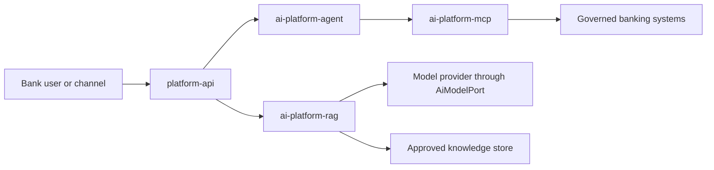
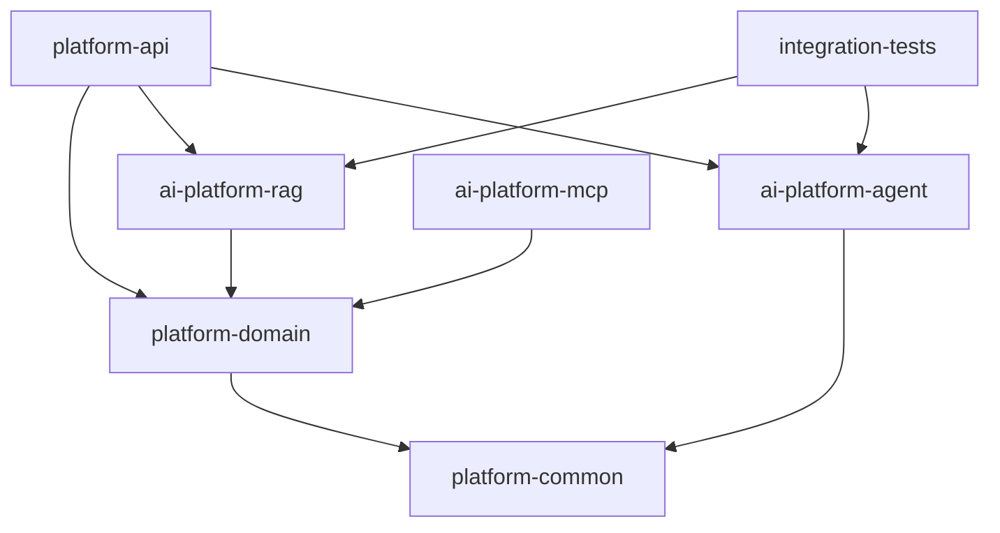
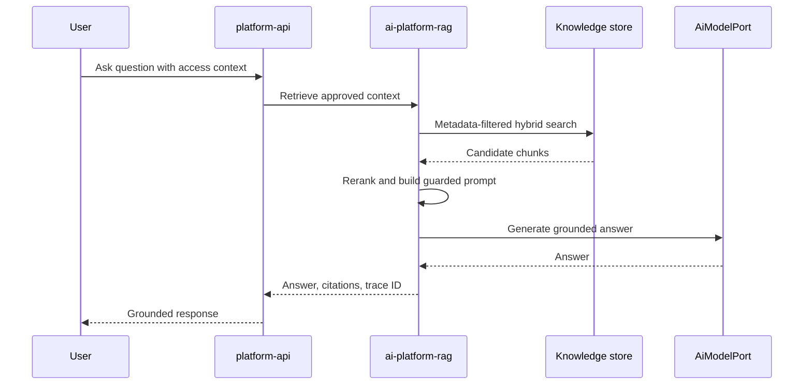
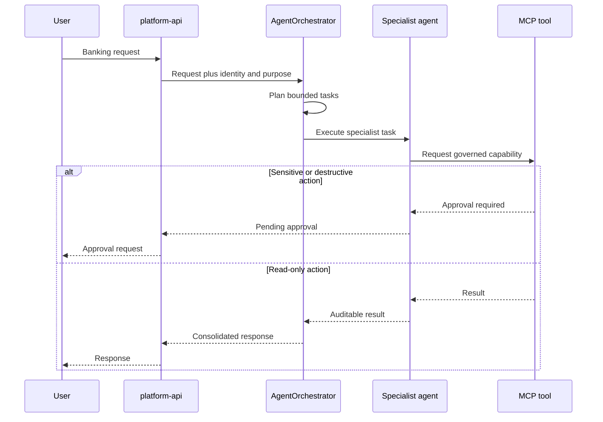

# Enterprise AI Platform — Canonical Architecture

**Status:** Accepted and binding 
**Baseline:** Days 1–5 
**Applies from:** Day 6 onward

This document is the architectural source of truth for the repository. Future lessons must extend this design incrementally. Module names, responsibilities, dependency direction, public contracts, and package roots must not be changed merely to accommodate a lesson.

## System context

## Fixed Maven modules

| Module | Permanent responsibility | Must not contain |
|---|---|---|
| `platform-common` | Small cross-cutting primitives such as correlation and execution context | Banking rules, web controllers, model-provider code |
| `platform-domain` | Stable domain records and ports for AI, RAG, agents, and banking operations | Spring Boot applications or infrastructure adapters |
| `ai-platform-rag` | Ingestion, chunking, embeddings, retrieval, reranking, prompt assembly, citations, and model adapters | HTTP controllers or banking write operations |
| `ai-platform-agent` | Planning, specialist agents, orchestration, execution state, and approval coordination | HTTP controllers or vendor-specific model clients |
| `ai-platform-mcp` | MCP protocol surface, resource/prompt exposure, tool registry, and governed banking tools | General REST APIs or RAG implementation |
| `platform-api` | Spring Boot application, REST endpoints, validation, configuration, and exception mapping | Core domain contracts or duplicated retrieval logic |
| `integration-tests` | Cross-module scenarios and architecture-level verification | Production application code |

These names are frozen. New modules require an Architecture Decision Record and explicit user approval.

## Dependency rules

Rules:

1. Dependencies point toward stable contracts; lower-level modules never depend on `platform-api`.
2. Modules communicate through typed Java contracts, not by importing implementation internals.
3. Business behavior must have one owner. Do not duplicate agent, retrieval, or tool logic across modules.
4. Model vendors are accessed through `AiModelPort`; provider details remain replaceable.
5. External banking actions are exposed as narrow, business-oriented capabilities with least privilege.

## Stable package roots

- `com.rawalpuneet.enterpriseai.common`
- `com.rawalpuneet.enterpriseai.domain`
- `com.rawalpuneet.enterpriseai.platform.rag`
- `com.rawalpuneet.enterpriseai.agent`
- `com.rawalpuneet.enterpriseai.mcp`
- `com.rawalpuneet.enterpriseai.banking`

Existing public types may be extended compatibly. Renaming or moving them requires a deprecation path, an Architecture Decision Record, and explicit user approval.

## Core runtime flows

### Grounded question answering

### Governed agent action

The existing card agent remains part of `platform-api` until its API-facing approval workflow is deliberately migrated behind a compatible contract. It must not be silently removed or replaced by a generic agent.

## Non-negotiable controls

- Treat retrieved documents and tool output as untrusted data, never as system instructions.
- Require authentication, authorization, purpose, and audit context for every enterprise tool call.
- Require explicit human approval for destructive or high-risk banking actions.
- Never place PANs, secrets, credentials, or unnecessary PII in prompts, logs, traces, or tool arguments.
- Return citations and document versions for knowledge-grounded responses.
- Apply timeouts, retry limits, idempotency, execution-step limits, and safe failure behavior.
- Preserve correlation IDs across API, agent, retrieval, model, and MCP boundaries.
- Keep in-memory adapters limited to local learning and tests; production adapters require durable storage and formal security review.

## Change policy for future days

Each day must be delivered as an incremental change against the previous committed baseline:

1. Add or modify only what the lesson requires.
2. Do not rename modules, package roots, existing endpoints, or established classes.
3. Do not regenerate or restructure the repository.
4. Preserve backward compatibility unless the user explicitly approves a breaking change.
5. Record new architectural decisions under `docs/adr/` before implementation.
6. Update this document only when the user explicitly approves an architecture change.
7. Run `mvn clean verify` before committing every daily change.
8. Report the exact changed files and commit SHA.

If a future requirement conflicts with this architecture, implementation pauses at the conflict. The proposed deviation, rationale, alternatives, migration impact, and rollback approach must be presented for approval first.

## Baseline technology decisions

- Java 25
- Spring Boot 3.5.x
- Multi-module Maven reactor
- REST for user-facing application APIs
- MCP for AI-discoverable enterprise capabilities
- Provider-neutral model port with Ollama as the local adapter
- Hybrid retrieval with metadata filtering and reranking
- Human approval for sensitive actions
- Actuator and Prometheus-compatible operational metrics

Version upgrades may be performed incrementally when compatible. Major framework changes require an Architecture Decision Record and explicit approval.
