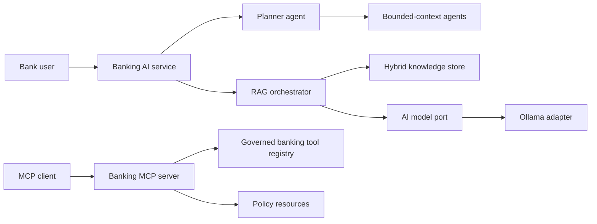

# Architecture

`platform-domain` contains stable ports and records. Infrastructure adapters live in `ai-platform-rag`; deployable services depend inward on those contracts. Agent planning is isolated in `ai-platform-agent`, and MCP capabilities in `ai-platform-mcp`. The demonstration store and card adapter are intentionally in-memory and must be replaced with durable, access-controlled systems before production use.

## Security boundaries

- Retrieved documents are treated as untrusted data and separated from system instructions.
- Sensitive card replacement requires explicit human approval.
- Tool input uses opaque identifiers; no PAN or secrets should enter prompts or logs.
- Production deployments must add OIDC, ABAC, immutable audit storage, secrets management, mTLS, rate limiting, and durable idempotency records.
